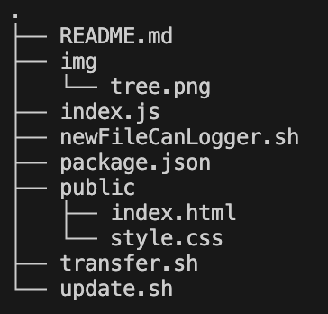

# Repository du plugin Signal K pour le projet SeaLab

## Repo


## Installation sur Signal K

 - Cloner ce repo en local avec la commande ```git clone https://github.com/Genesi0/pluginSeaLab.git```.
 - Se déplacer dans le répertoire ```cd plugInSeaLab/```.
 - Lancer ```transfer.sh``` via la commande ```sh transfer.sh```.
 - Ce programme vous demande par deux fois le mot de passe de l'utilisateur ```pi```. (Pour transférer les fichiers, et se connecter à la Raspberry en ssh).
 - Une fois connecté en tant que ```pi``` sur le Rapsberry, se déplacer dans le répertoire ```cd plugInSeaLab/```.
 - Lancer ```update.sh``` via la commande ```sh update.sh```.
 - Le serveur Signal K vous demande le mot de passe pour pouvoir redémmarer.
 - Voilà, le plugin SeaLab est installé sur votre serveur Signal K.